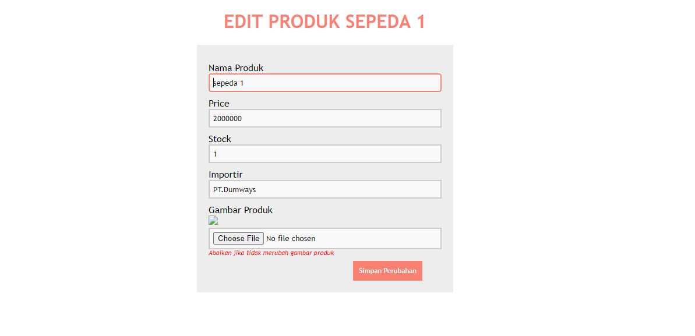
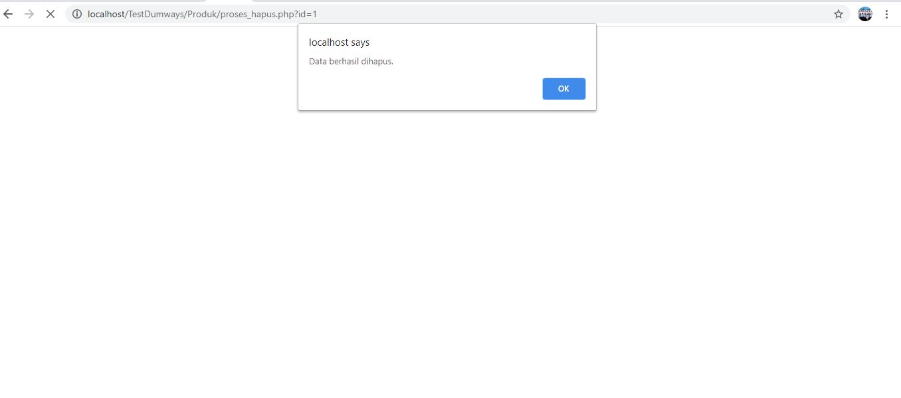

###################
TEST DUMWAYS
###################

Berikut Merupakan Penjelasan Dari Soal Yang Diberikan.

*******************
Soal 1
*******************

Mengubah/Mengkonfersi String Menjadi Bilangan Binary 
****************************************************
Soal 3
*******************
Mebuat string bintang menjadi bentuk Ketupat dengan kondisi kelipatan Habis dibagi 2
**************************
Soal 7
**************************
Aplikasi Pendukung
-Web Sever (XAMPP)
-PHP
-SQL

Instalasi
- Buat Database arkademy
- Import SQL arkademy.sql Kedalam Database
- Jalankan Website

*******************
Screen Shoot Aplikasi
*******************
Tampilan SQL Database 
**************************

**************************
Tampilan HOME PRODUK DAN IMPORTIR (View)
****************************************

***********************************

******************************************
Tampilan Insert Produk
**************************

********************************************
Tampilan Insert Importir
************************

**********************************************
Tampilan Edit
**************************

*******************************************
Tampilan Delete Produk
**************************

*****************************************
Tampilan Delete Importir
*************************

*****************************************
Tampilan Success Delete
**************************

**************************
